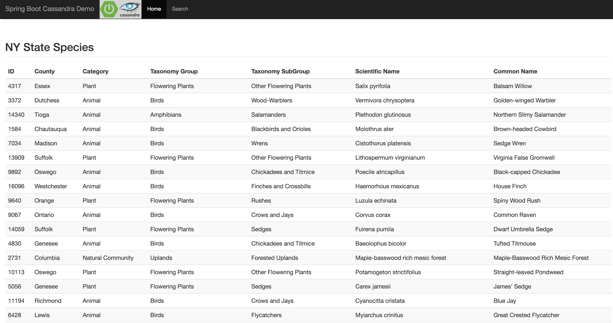

# Cassandra  
This guide provides sample yamls to deploy a 3-node stateful-set Cassandra cluster, load data from an external data set and to deploy a java client dashboard.

Cluster uses the DockerHub Official Cassandra image maintained by Docker community. The main intention of this repo is demonstrate a stateful-set workload and not to recommend this specific Cassandra deployment.

Make sure you clone this repo to get access to the yml files in it that will be referenced during this tutorial.

## Prerequisites
You'll need a provisioned kubernetes cluster, and access to it via `kubectl`
You'll need worker nodes with at least 4GB RAM

## Deploy the Cassandra cluster
Make sure you have defined a default Storage Class named `default`.
Run this command if on vSphere without one:
```
kubectl create -f cluster/storage-class-vsphere.yml
```
Install 3-node stateful-set cluster running this command:
```
kubectl apply -f cluster/cassandra-demo-cluster.yml
```
Each node will be created sequentially. Wait for all nodes to be created before moving to next step.
You can also check the status of the cluster running `nodetool` in one of the nodes with a command like this:
```
kubectl exec -it cassandra-pks-demo-0 nodetool status
```
2 services are deployed alongside the stateful-set:
- One of `type: LoadBalancer` to facilitate external clients to connect to the cluster
- One standard and headless to allow internal clients to connect to the cluster
For the LB to work your PKS installation needs to run on GCP or be integrated with NSX-T.

## Bootstrap Cassandra cluster with a sample data set
The following command will bootstrap the Cassandra cluster with a keyspace and a table loaded with data from a sample NYC Species data-set, using a ConfigMap and an external file with the raw data.
```
kubectl apply -f cassandra-demo-bootstrap.yml
```

## Deploy a client UI
The following command will deploy a Spring Boot app with a UI to be used as a client targeting the Cassandra cluster, with a couple of queries/searches to simulate access to the data:
```
kubectl apply -f cassandra-demo-client.yml
```
A `type: LoadBalancer` service is deployed alongside the client Deployment to allow access to the 3-replica based application.
For the LB to work your PKS installation needs to run on GCP or be integrated with NSX-T.

Here's a screenshot with how it looks like.

